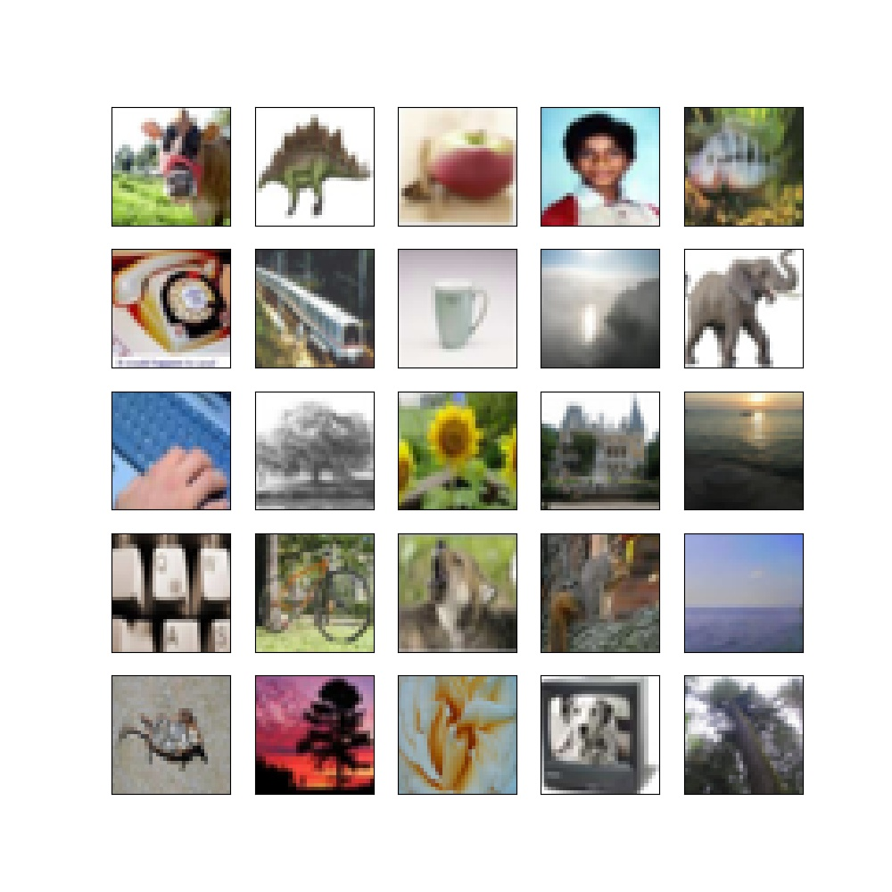
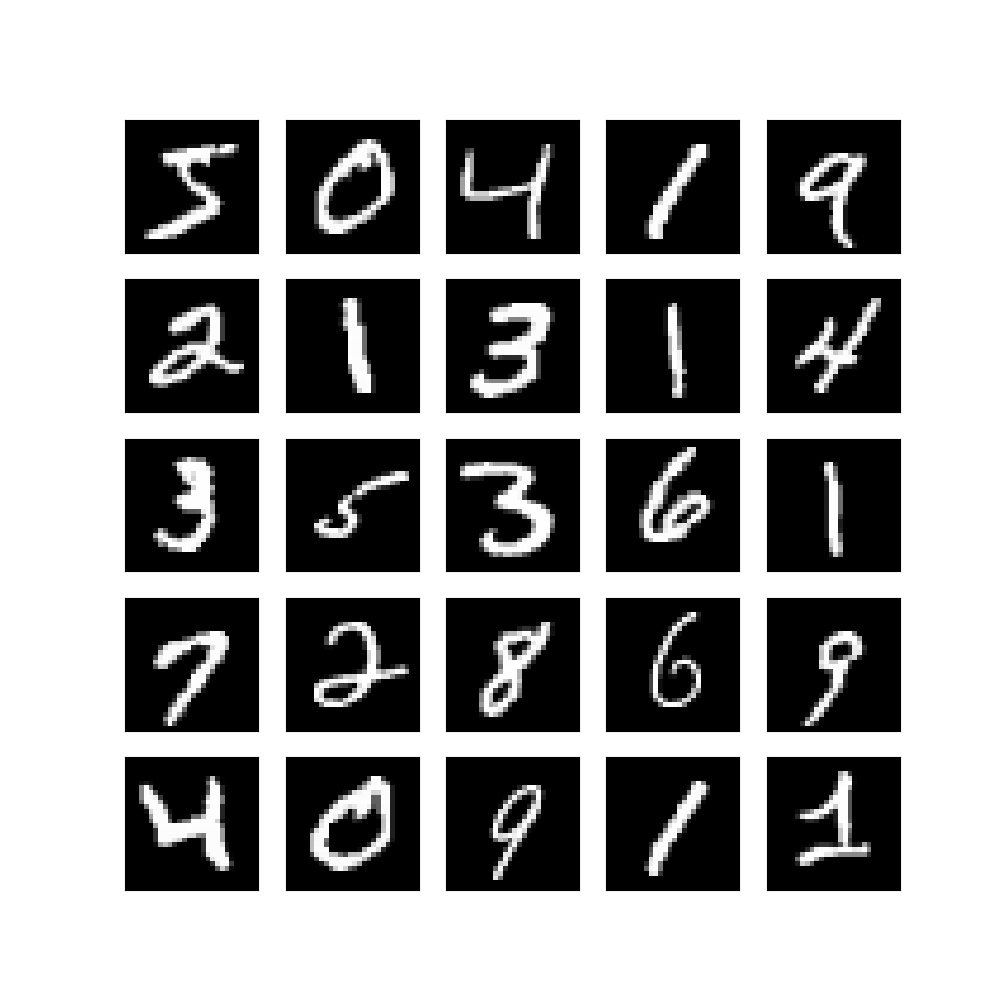
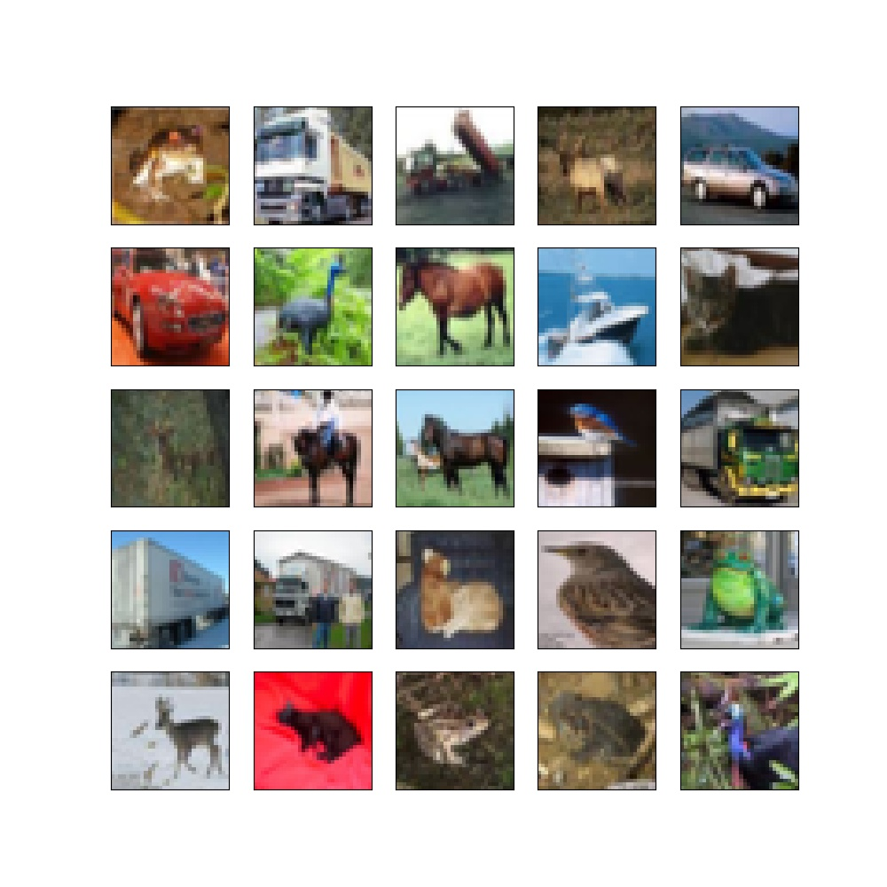
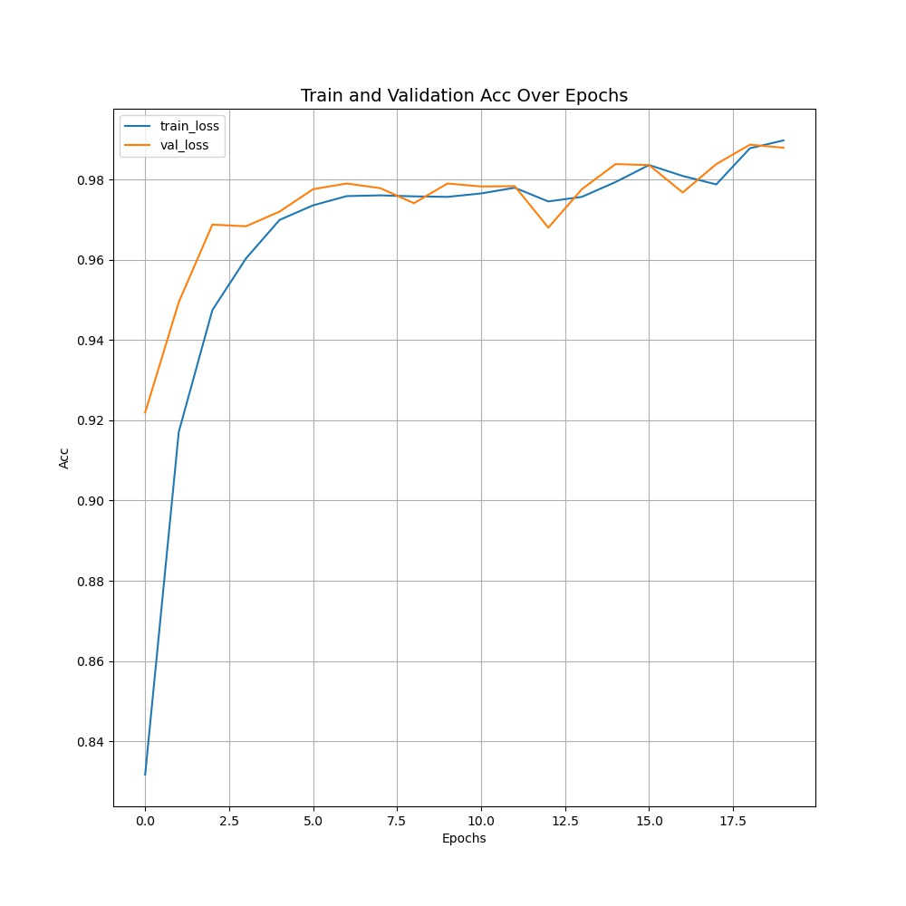
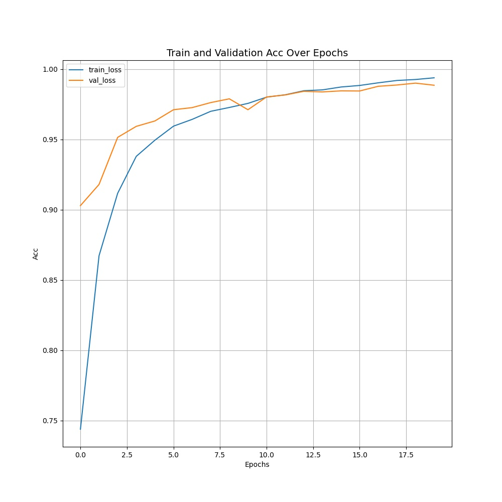
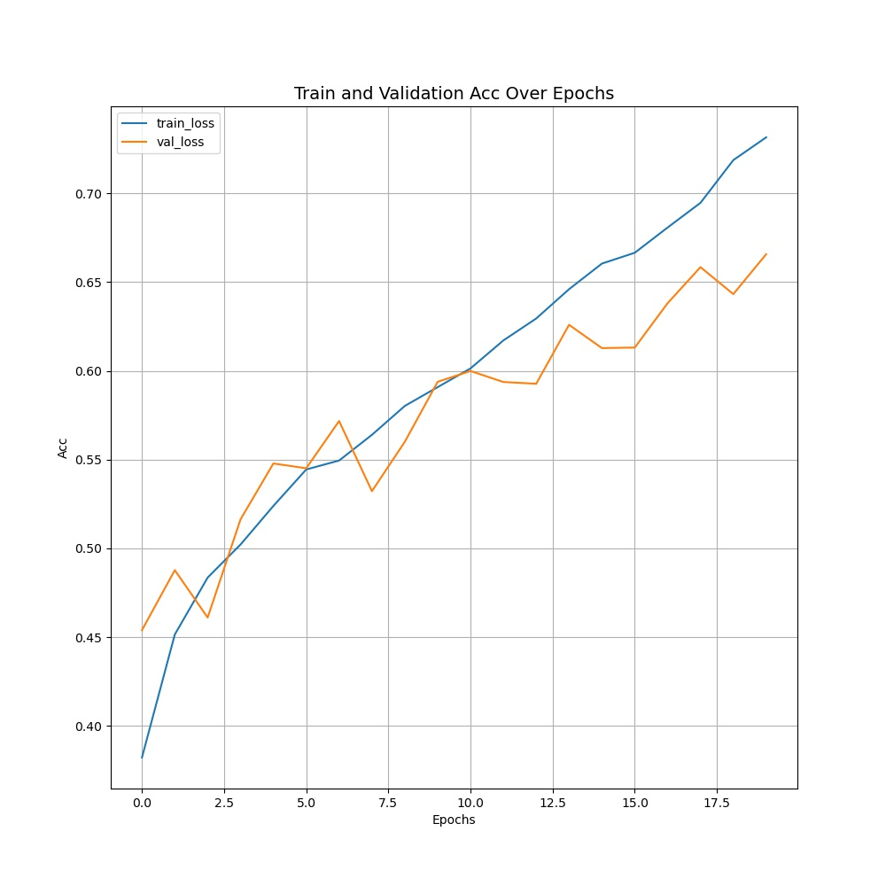
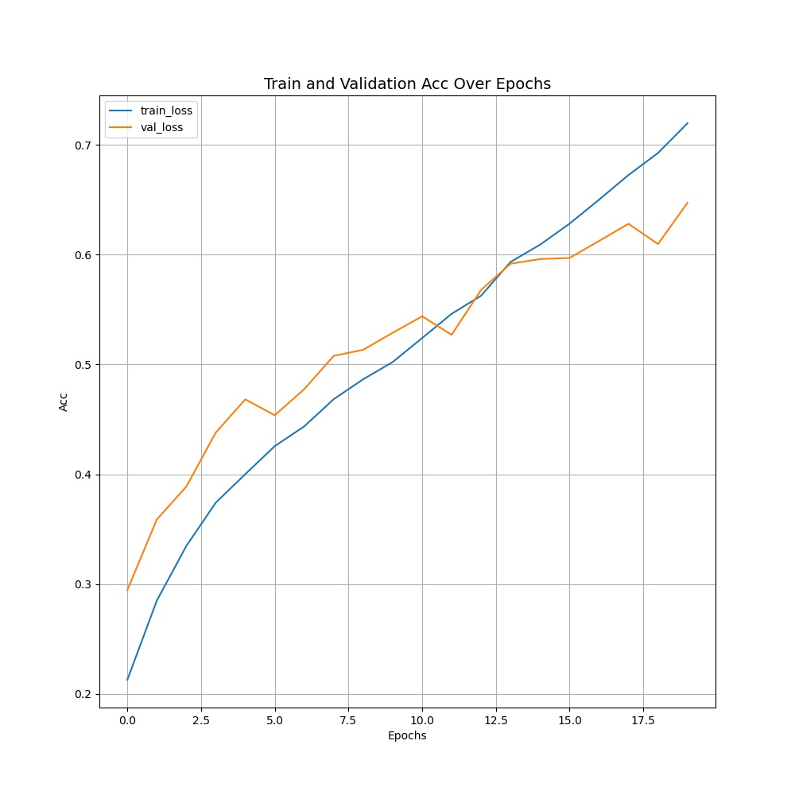

Shifted WIndowing approch for coputing self-attention Transformer(Swin-transformer V1, V2)
===

This is Swin-transformer by keras.

## Usage  
```bash
python run.py mnist pretrain
```

## Result  
- Pre-train -> CIFAR100  
- Fine tune -> MNIST, CIFAR10  
- Epoch : 20

<div align="center">
  <p>
    
  </p>
  <p>cifar100 samples for pre-train</p>
</div>

|type|MNIST(acc)|cifar10(acc)|
|:---|-------:|------:|
|samples|||
|Only train|98.77|63.94|
|Fine tune|98.98|65.98|

### history  

|type|Fine tune|Only train|
|:--|--:|--:|
|MNIST|||
|cifar10|||

## Requiremnets
Tensorflow 2.3.0

## Reference
[1] Liu, Ze, et al. "Swin transformer: Hierarchical vision transformer using shifted windows." arXiv preprint arXiv:2103.14030 (2021).  
[2] Liu, Ze, et al. "Swin Transformer V2: Scaling Up Capacity and Resolution." arXiv preprint arXiv:2111.09883 (2021).